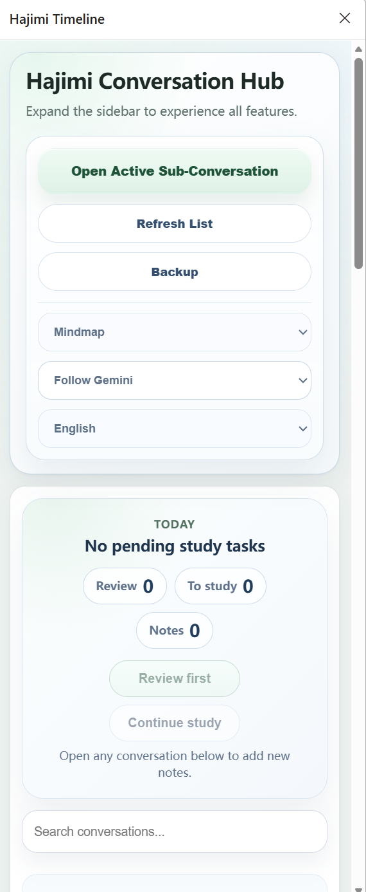

# Hajimi Study Cards

[English](README.md) | [简体中文](README.zh-CN.md)


> 把 Gemini 对话整理成学习卡片、追问主题、笔记批注、书签和复习任务。

Hajimi Study Cards 是一个面向学习场景的浏览器扩展。它不再鼓励用户管理一堆零散对话记录，而是把使用路径收束成一个更清晰的闭环：选中一个问题，围绕它追问到真正理解，再生成一张可以复习的学习卡片。



## v1.1.290 更新重点

这个版本把产品重心从“侧边栏学习管理工具”调整为“学习卡片工作台”。

- 新增以单个问题为中心的学习卡片工作台
- 卡片编辑改为结构化字段：核心知识点、我的理解、易错点、复习问题、来源摘录、标注说明
- 追问区和卡片区改为 Tab 切换，避免展开侧边栏后并列展示造成拥挤
- 时间轴右键支持“设为追问主题”和“加入追问主题”
- 同一追问组的时间点会自动圈选并用同色连线，主问题显示“主”，分支问题显示“分”
- 卡片来源索引区区分待学习和已完成来源
- 底部流程按钮固定，卡片编辑区增加滚动预留，保存和取消按钮不再被遮挡
- 导出卡片图片时包含当前学习卡片内容
- 本地打包 MathJax，提升公式内容在扩展内的渲染稳定性

## 核心使用流程

1. 打开一个 Gemini 对话。
2. 在浏览器侧边栏打开 Hajimi Study Cards。
3. 选择一个对话时间点作为当前学习问题。
4. 在追问区继续问清楚这个问题。
5. 在卡片区生成或编辑结构化学习卡片。
6. 把卡片加入复习、标记已掌握、导出图片，或完成并进入下一题。

这个版本的目标很明确：每次学习都尽量沉淀为一张有复习价值的学习卡片，而不是只留下更长的聊天记录。

## 功能亮点

- **学习卡片优先**：工作台围绕“生成学习卡片”组织，而不是堆叠多个管理模块。
- **结构化编辑**：不再只给用户一个大输入框，而是引导用户分别填写知识点、理解、易错点和复习问题。
- **时间轴追问联动**：右键把 A 设为追问主题，再把 B 加入追问主题，时间轴会自动圈起来并连线。
- **多颜色追问组**：不同追问组使用不同颜色，方便区分多个学习线索。
- **界面减法**：追问区和卡片区通过 Tab 切换，避免同时展示导致认知负担过高。
- **本地优先**：笔记、卡片、书签、复习状态和设置都保存在 `chrome.storage.local`。
- **复习闭环**：卡片可以加入复习或标记已掌握。
- **图片导出**：可以把当前学习卡片导出为图片，方便保存或分享。

## 隐私说明

- 只在 `https://gemini.google.com/*` 上运行
- 学习数据保存在浏览器本地 `chrome.storage.local`
- 不会把 Gemini 对话内容发送到第三方服务器
- 支持在工作台设置中进行本地备份/导出
- 卸载扩展时，浏览器可能会清除扩展本地存储

## 开发安装

1. 构建扩展，或使用 `dist/` 中最新的构建目录。
2. 打开 `edge://extensions/` 或 `chrome://extensions/`。
3. 启用 **开发者模式**。
4. 点击 **加载已解压的扩展程序**。
5. 选择扩展目录，例如 `dist/gemini-study-timeline-v1.1.290`。
6. 打开 `https://gemini.google.com`，开始使用侧边栏。

## 开发命令

构建：

```powershell
npm run build
```

检查 JavaScript 语法：

```powershell
npm run check
```

发布辅助：

```powershell
npm run release
```

发布 dry run：

```powershell
npm run release:dry
```

## 项目结构

```text
.
├── docs/                 文档、截图和演示素材目录
├── scripts/              构建和发布脚本
├── vendor/               本地打包的浏览器端第三方库
├── background.js         扩展 service worker
├── content.js            Gemini 页面集成和时间轴 UI
├── perf-bridge.js        页面性能采集桥接
├── sidepanel.html        侧边栏入口
├── sidepanel.js          侧边栏逻辑
├── style.css             主样式
├── workbench-override.css 工作台最终布局覆盖
├── manifest.json         浏览器扩展清单
├── package.json          开发命令
└── CHANGELOG.md          版本说明
```

## 发布产物

当前最新构建包：

```text
dist/gemini-study-timeline-v1.1.290.zip
```

## 项目状态

项目仍在积极迭代中。当前最重要的方向是让学习卡片流程更清晰、更轻量，并且更适合真实学习场景。

## License

MIT
